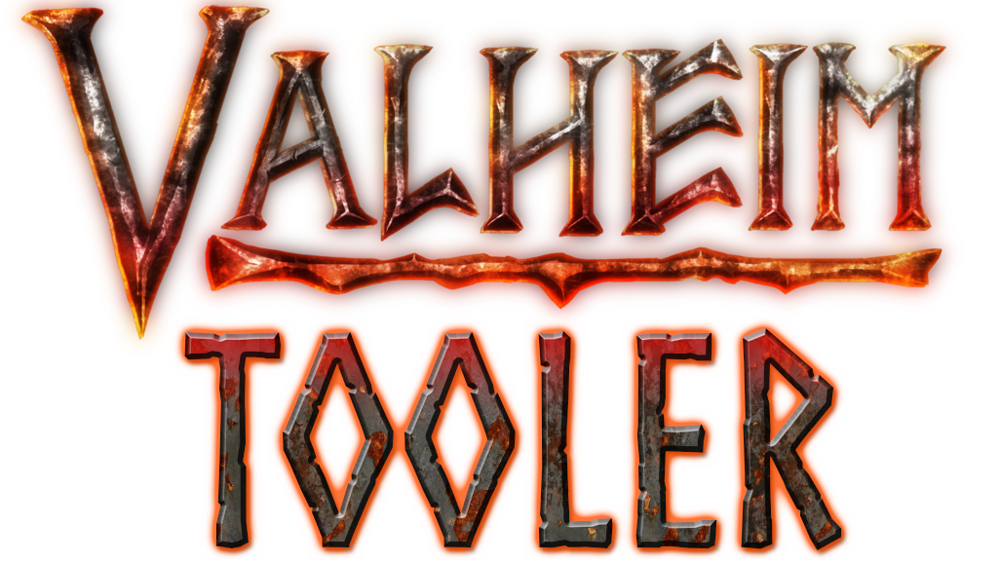

<h1 align="center">
   
  
</h1>

  
  
  
  

  

    <a href="./README-FR.md">French Version </a>

  <a href="#about">About</a> •
  <a href="#usage">Usage</a> •
  <a href="#contributing">Contributing</a> •
  <a href="#special-mentions-and-credits">Special mentions and credits</a>

## About

ValheimTooler is a free software that allows you to cheat on the Valheim game via a multitude of options offered. This project is purely for educational purposes, I am not responsible for the use you make of it. Be reasonable some features are particularly game breaker.

Here is the list of features offered by this tool:

* **Player**
  * God Mode, you don't lose any more life
  * Unlimited stamina for you
  * Unlimited stamina for the other players
  * No stamina for the other players
  * Fly Mode, sweet creative mode 🕊️
  * Ghost Mode, the monsters cannot see you
  * No placement cost
  * Explore all your minimap (Irreversible on the world on which it is activated!)
  * Reset your minimap
  * Teleport a player to another player (works only if the player is visible on the minimap), to minimap marker or coordinates
  * Allow teleporting with restricted items
  * Instantly heals a player
  * Instantly heals all players
  * Activate a Guardian Power for you
  * Activate a Guardian Power for all players
  * Raise/Decrease a skill to any level
  * Tame all nearby creatures
  * Unlimited weight for inventory
  * Fast crafting
* **Entities & Items**
  * Spawn any entity
  * Delete all drops on the ground
  * An Item Giver to add any item you want in your inventory
* **Miscellaneous**
  * Inflict damage to a player (ignores the no-pvp mode)
  * Kill all entities except players
  * Kill all players
  * Auto-pin on the minimap the deposits
  * Send a event message to all players (the yellow one on the middle of the screen)
  * Send a chat message as any username
  * A ESP for players, monsters, pickables, deposits and drops with radius setting

**⚠️ Warning ⚠️**: On each feature that allows you to choose a player, the list will only include players who are at a certain distance from you (quite large but not the whole map for all that). This is not a personal choice but a technical limitation of the game. Until I find a way to get around it (if possible) this behavior will remain.

## Usage

I made sure that you can install and run this tool easily. Just [go here](https://github.com/Astropilot/ValheimTooler/releases) to download the latest version. Take the .zip and extract it to any folder. Then run the `ValheimToolerLauncher.exe` and click on `Install`.

If the button is not available it is likely that the program has not found the path to the game, specify it just below and the button should become clickable.

Once the installation is complete, run the game with the launcher open. Once you get to the main menu (AND NOT BEFORE) of the game you can click on `Launch` and the cheat should appear in game. To show/hide the cheat window you can press `Del` on your keyboard.

When a cheat update is available, the launcher allows you to update the cheat directly. A button will appear and you just have to click on it to automatically install the latest version!

If you want to uninstall the cheat you just have to press the `Uninstall` button.

**Note**: If the installation or uninstallation ever prevents the game from launching, you can always ask Steam to check the integrity of the game files and it will repair the corrupted files.

Here is also a video tutorial explaining its installation and a demonstration of its features:

### Configuration

A configuration file is available to modify some of the tool's parameters, this file is created when the tool is first launched.
The file is available:
- If you use the launcher the file should appear in the same place as the `ValheimToolerLauncher.exe`
- If you use the BepInEx version, it should be available in the `BepInEx/config` folder

The name of the configuration file is `valheimtooler_settings.cfg`

This file allows you to modify the following parameters:
- Change the key that displays/hides the tool, defaulting to the Delete key
- Choose to show the tool when it starts, default is active
- Choose the display language of the program, auto by default (depending on the game language)

## Contributing

The project is open for contributions! Open an Issue to propose new features or directly make a merge request if you want to implement it yourself. Please respect the conventions defined by editorconfig! It should be automatically taken into account by Visual Studio.

A more complete contributing file will arrive soon...

## Special mentions and credits

* Thanks to the [Guided Hacking](https://guidedhacking.com/threads/how-to-hack-unity-games-using-mono-injection-tutorial.11674/) and [Unknown Cheats](https://www.unknowncheats.me/forum/unity/285864-beginners-guide-hacking-unity-games.html) forums for their tutorials that gave me the basics to design an injectable cheat
* Many thanks to [wh0am15533](https://github.com/wh0am15533) for its [Unity Runtime DevTools](https://www.unknowncheats.me/forum/unity/388951-unity-runtime-devtools-v1-01-a.html) utility from which I got some parts related to resource loading in the assembly and its [SharpMonoInjector](https://github.com/wh0am15533/SharpMonoInjector) update
* Thanks to [KillerGoldFisch](https://github.com/KillerGoldFisch) for his proposal to put this tool as a mod for BepInEx as well as [his example code](https://github.com/KillerGoldFisch/ValheimToolerLoaderMod) for the implementation of this plugin
* Many thanks to [BastienMarais](https://github.com/BastienMarais) for his precious help during the development phase for his tests and feature ideas!
